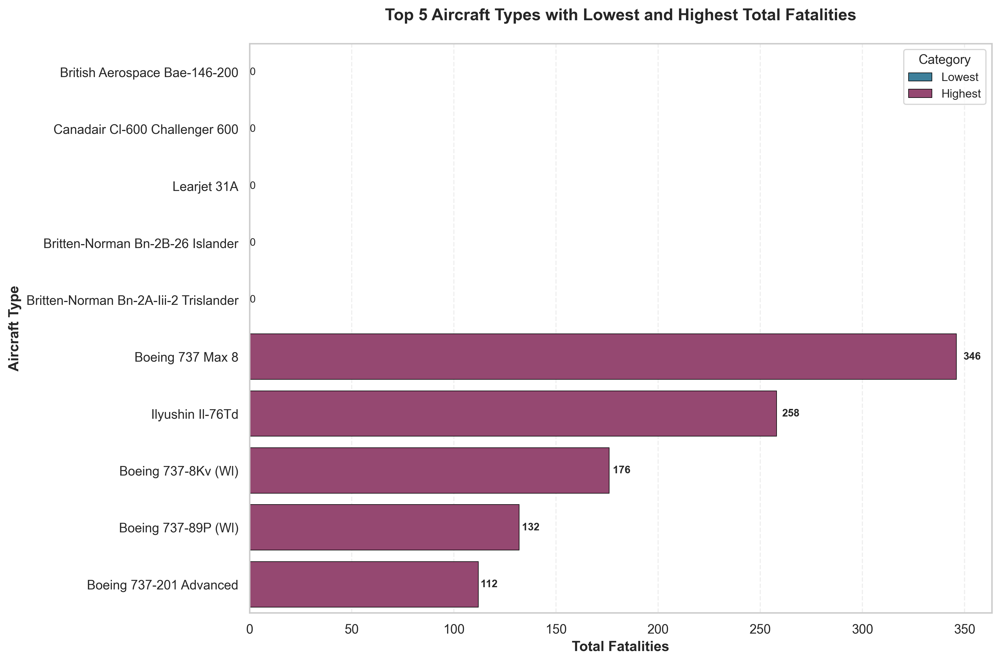
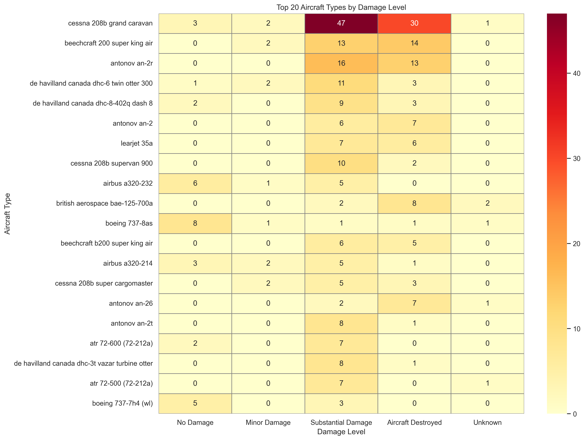
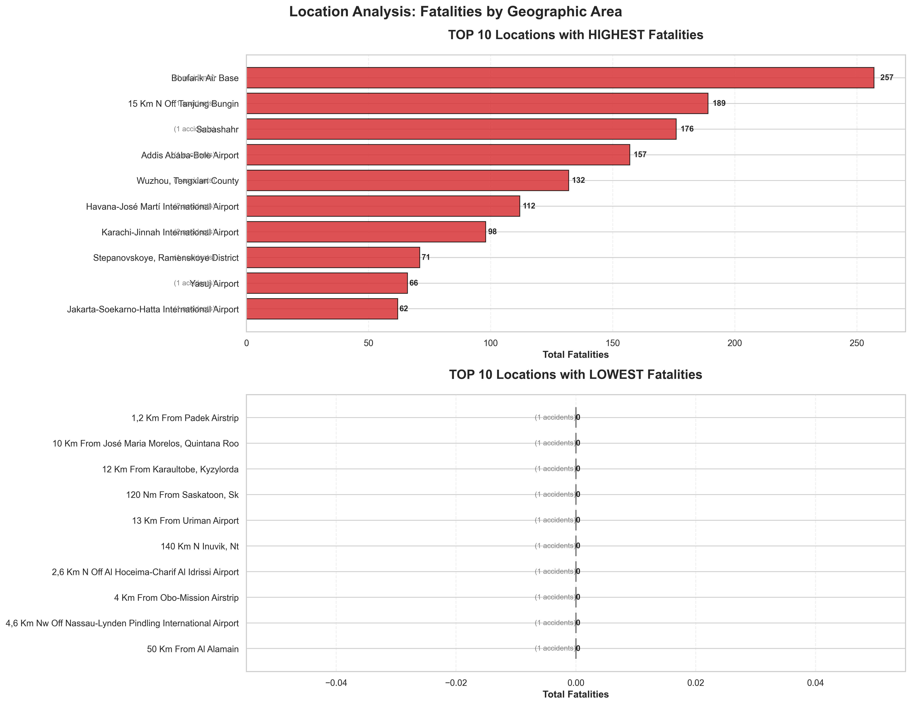

AIRCRAFT RISK ANALYSIS FOR THE PERIOD BETWEEN 2018 to 2022

Business understanding 

    Future business expansion of aircraft as a blue print for both commercial and private enterprise, in order to achieve this considering number of factors to be considered for example type of aircraft and  potential risks over time

    A company is expanding into aviation operation require expertise informed decision that guided by evidence based in relation to aircraft safety risks.

General objective
    To determining aircraft type with lowest risk of operation for commercial and private company

Specific objectives

   1.  To Identify aircraft_type with lowest and highest fatalities
   2.  To establish damage level for aircraft type
   3.  To establish fatalities by the month of the year
   4.  To establish location with lowest and highest fatalities
  
Data understanding
    Data from Flight aviation was extracted from Kaggle which are in ms Excel format.It was it was noted that these had two thousand five hundred (2,500) rows and eight (8) columns.From first impression three(3) columns had missing values.
    
Data Preparation
    Exploration of these data include loading and cleaning for example checking for duplicate, missing,renaming of column and uniqueness of value among other quality checks. Data analysis was using statistical measures like measures of central tendancy, quality verification which help in deducing insight for informed recommendation and decison making.

Data analysis and visualization
    Data analysis and visualization was based on specific objective of which are aircraft_type with lowest and highest fatalities, damage level for aircraft type, fatalities by the month of the year and location with lowest and highest fatalities

## 📊 Visualizations

### 1. Fatalities Comparison

This bar chart compares the top 5 aircraft types with the lowest and highest total fatalities:

insight, Some aircraft types are consistently involved in more severe fatal outcomes than others

### 2. Damage Level Heatmap

The heatmap shows the distribution of damage levels for the top 20 aircraft types with the most accidents:

Insight, Damage level of Aircraft types with Destroyed, substantial damage counts leads financial loss exposure, long downtime & repair costs respectively, while  Mostly minor damage shows survivable accidents

### 3. Fatalities by Month

This line chart shows fatalities distribution across months of the year:

Insight, Period of time in a year determine risk patterns, therefore there are relationship between fatalities and specific month of the year

### 4. Locations with Highest and Lowest Fatalities

This dual bar chart compares locations with the highest and lowest fatality counts:

Insight, Location of aircraft determine fatality case for example Mountain terrain

Recommendation

- Prioritize aircraft types with historically low accident rates
- Improved safety system should be primary factor in investing in aircraft models 
- Consider safety history in acquiring aircraft type
- Frequently linked aircraft categories which are prone to severe or fatal incidents should be avoided

Next Steps
        Consider seasonal risk in operational planning
        I recommend comparison study of safety history in different regions so that skewdness and outliars are well catered for
        More time to accident evalution in various continet

interactive tableau link < https://public.tableau.com/app/profile/mohamed.satawa/viz/AircraftRiskAnalysis_17698868548880/AIRCRAFTRISKANALYSIS?publish=yes >