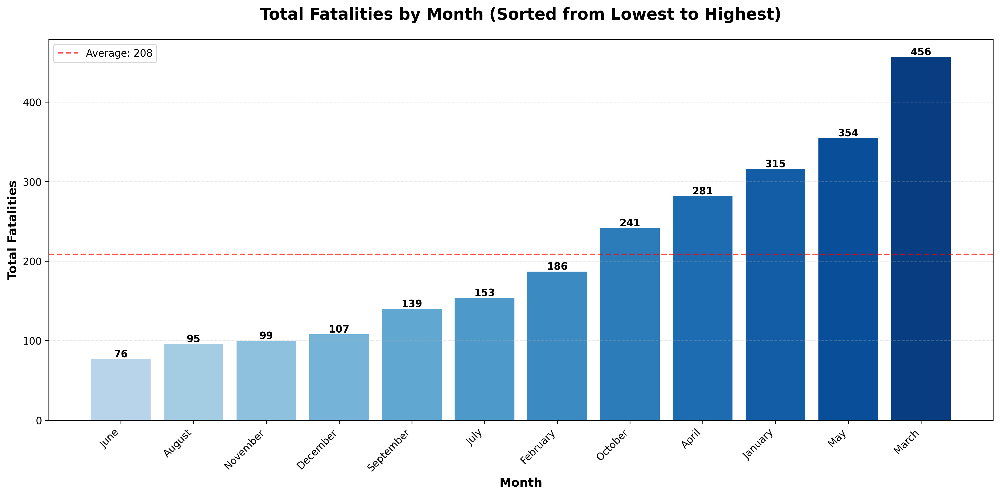

# Monthly Fatalities Analysis

## 📊 Visualization

## 📈 Key Statistics

- **Total Fatalities**: 2,502
- **Monthly Average**: 208.5
- **Safest Month**: June (76 fatalities)
- **Most Dangerous Month**: March (456 fatalities)

## 📋 Monthly Breakdown (Lowest to Highest)

| Month | Total Fatalities |
|-------|------------------|
| June | 76 |
| August | 95 |
| November | 99 |
| December | 107 |
| September | 139 |
| July | 153 |
| February | 186 |
| October | 241 |
| April | 281 |
| January | 315 |
| May | 354 |
| March | 456 |

## 📊 Data Interpretation

The visualization shows aviation accident fatalities by month, sorted from lowest to highest. The red dashed line represents the monthly average of 208 fatalities.

### Key Observations:
1. **June** has the lowest fatalities with **76**
2. **March** has the highest fatalities with **456**
3. The range between lowest and highest is **380** fatalities

## Generated Using
- Python
- Matplotlib
- Pandas
- Data Analysis of Aviation Accidents

*Last Updated: 2026-02-03 00:30*
