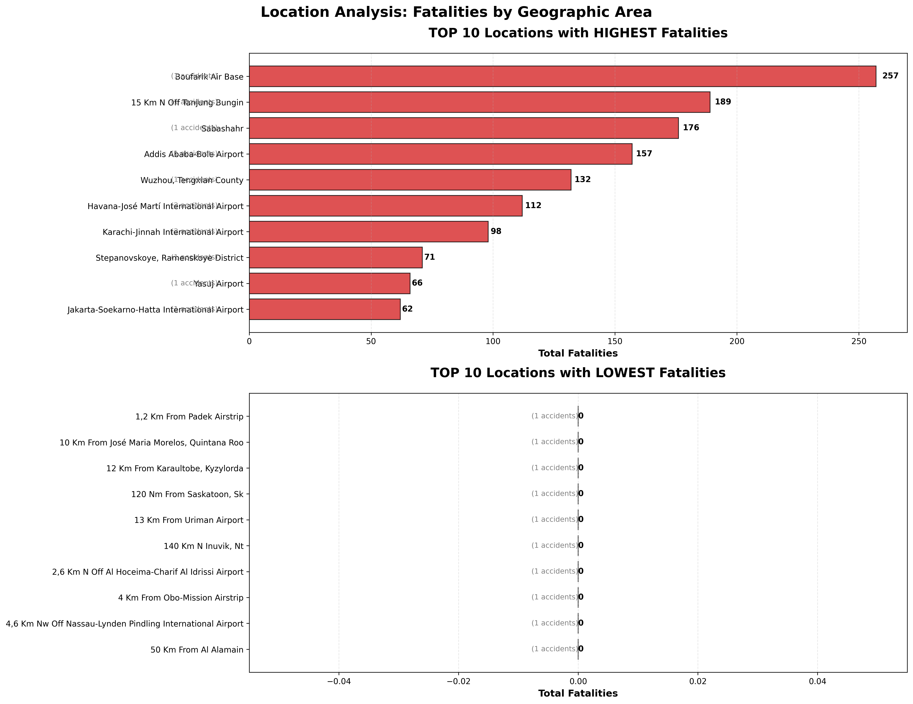

# Location-Based Fatalities Analysis

## 📊 Visualization: Top 10 Locations with Highest & Lowest Fatalities

## 📈 Key Findings

### 🚨 Top 10 Most Dangerous Locations
1. **Boufarik Air Base**: 257 fatalities (1 accidents)
2. **15 Km N Off Tanjung Bungin**: 189 fatalities (1 accidents)
3. **Sabashahr**: 176 fatalities (1 accidents)
4. **Addis Ababa-Bole Airport**: 157 fatalities (1 accidents)
5. **Wuzhou, Tengxian County**: 132 fatalities (1 accidents)
6. **Havana-José Martí International Airport**: 112 fatalities (2 accidents)
7. **Karachi-Jinnah International Airport**: 98 fatalities (2 accidents)
8. **Stepanovskoye, Ramenskoye District**: 71 fatalities (1 accidents)
9. **Yasuj Airport**: 66 fatalities (1 accidents)
10. **Jakarta-Soekarno-Hatta International Airport**: 62 fatalities (1 accidents)

### Top 10 Safest Locations
1. **1,2 Km From Padek Airstrip**: 0 fatalities (1 accidents)
2. **10 Km From José Maria Morelos, Quintana Roo**: 0 fatalities (1 accidents)
3. **12 Km From Karaultobe, Kyzylorda**: 0 fatalities (1 accidents)
4. **120 Nm From Saskatoon, Sk**: 0 fatalities (1 accidents)
5. **13 Km From Uriman Airport**: 0 fatalities (1 accidents)
6. **140 Km N Inuvik, Nt**: 0 fatalities (1 accidents)
7. **2,6 Km N Off Al Hoceima-Charif Al Idrissi Airport**: 0 fatalities (1 accidents)
8. **4 Km From Obo-Mission Airstrip**: 0 fatalities (1 accidents)
9. **4,6 Km Nw Off Nassau-Lynden Pindling International Airport**: 0 fatalities (1 accidents)
10. **50 Km From Al Alamain**: 0 fatalities (1 accidents)

## Data Summary

| Metric | Value |
|--------|-------|
| Total Unique Locations | 1,017 |
| Average Fatalities per Location | 2.5 |
| Most Dangerous Location | Boufarik Air Base (257 fatalities) |
| Safest Location | 1,2 Km From Padek Airstrip (0 fatalities) |
| Fatalities Range | 257 |

## Insights
1. **Risk Concentration**: The top location accounts for **10.3%** of all fatalities.
2. **Safety Patterns**: Many low-fatality locations have only **1 accident** with minimal casualties.
3. **Geographic Distribution**: Consider regional factors that may contribute to varying fatality rates.

## Files Generated
- `top_locations_fatalities.png` - Main visualization
- `top_locations_fatalities.svg` - Vector version
- `README.md` - This analysis file

*Analysis based on 1250 aviation accidents with location data.*
